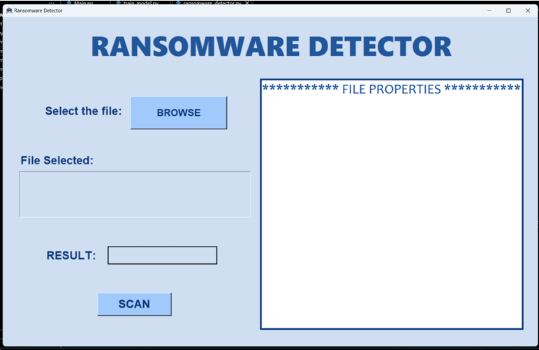
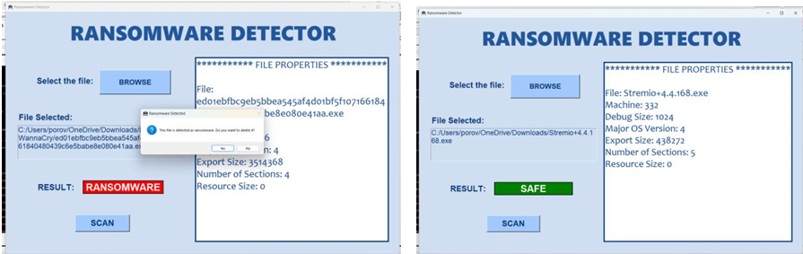

# 🔐 Ransomware Detector with GUI & OpenTelemetry

  
  
  
  

This project is a **Ransomware Detection Application** built using **Python, Tkinter, Machine Learning (Scikit-Learn), and OpenTelemetry**.  
It allows users to upload executable files (`.exe`, `.dll`, `.bin`), extracts **PE file features**, classifies them as **SAFE** or **RANSOMWARE** using a trained ML model, and provides a simple GUI interface with the option to delete detected ransomware files.  

Additionally, **tracing and monitoring** are integrated with [SigNoz](https://signoz.io/) using OpenTelemetry.

---

## ✨ Features

- 🖥️ **GUI Interface** (Tkinter) for easy file scanning  
- 📂 **File Selection** for `.exe`, `.dll`, `.bin` files  
- 🧠 **ML-based Classification** using pre-trained model (`ransomware_model.pkl`)  
- 📊 **Feature Extraction** from PE headers using `pefile`  
- ✅ **SAFE / RANSOMWARE Detection** with color-coded results  
- ⚠️ **Option to Delete File** if ransomware is detected  
- 📡 **Observability** via OpenTelemetry + SigNoz  

---

## 🖼️ Screenshots

*(Add your screenshots in a `/screenshots` folder and update paths below)*  

### 🔑 Main Window  
  

### 🕵️ Scan Result  
  

---

## 🛠️ Tech Stack

- **Programming Language:** Python 3.9+  
- **GUI Framework:** Tkinter  
- **PE File Parsing:** [pefile](https://github.com/erocarrera/pefile)  
- **Machine Learning:** Scikit-Learn, Pandas, Joblib  
- **Monitoring:** OpenTelemetry, SigNoz  
- **Model Files:**  
  - `ransomware_model.pkl` → trained ML classifier  
  - `scaler.pkl` → feature scaler  
  - `ransomware_dataset.csv` → feature reference  

---
